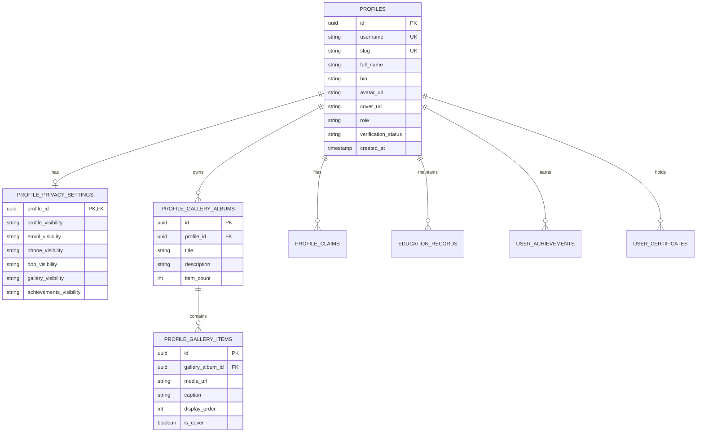
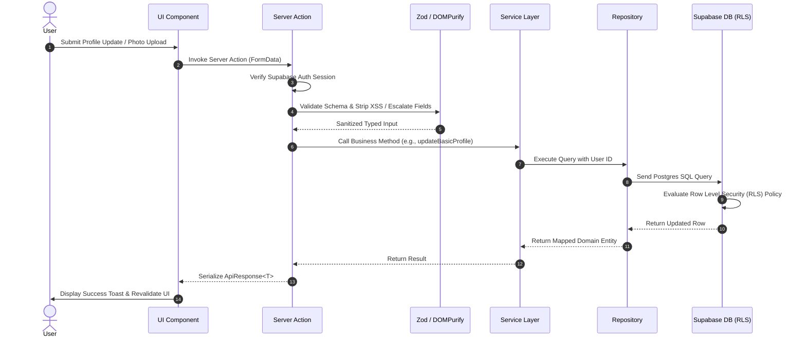
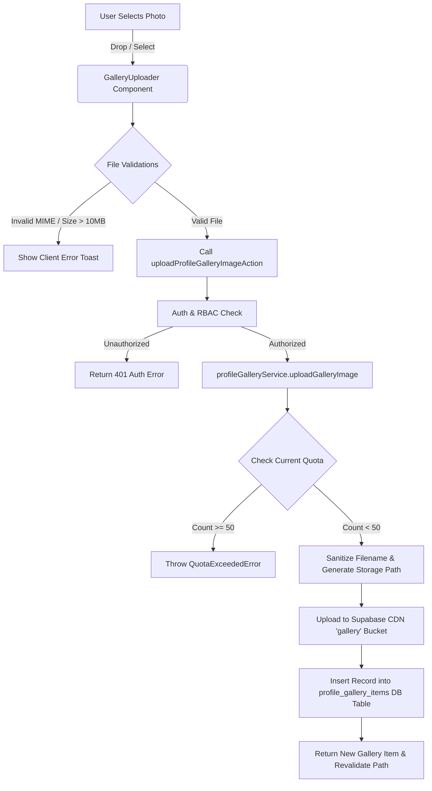

# 19 - Profile System Enterprise Specification

**Project:** Ravenshaw Moments\
**Version:** 2.0 (Enterprise Architectural Release)\
**Status:** 🚀 Synchronized with Production Implementation\
**Document Type:** Profile Ecosystem Architectural & API Specification

---

## Table of Contents
1. [Purpose & Objectives](#1-purpose--objectives)
2. [Architectural Specifications](#2-architectural-specifications)
   - [Component Architecture](#21-component-architecture)
   - [Service Layer Architecture](#22-service-layer-architecture)
   - [Repository Layer Architecture](#23-repository-layer-architecture)
   - [Server Action Flow](#24-server-action-flow)
   - [Storage Architecture](#25-storage-architecture)
3. [Security & Access Control](#3-security--access-control)
   - [Permission Matrix](#31-permission-matrix)
   - [Row Level Security (RLS) Policy Matrix](#32-rls-policy-matrix)
   - [Privacy & Visibility Matrix](#33-privacy--visibility-matrix)
4. [Database & ER Schema](#4-database--er-schema)
   - [ER Diagram](#41-er-diagram)
   - [Table Dictionary](#42-table-dictionary)
5. [Developer Reference](#5-developer-reference)
   - [Component Reference](#51-component-reference)
   - [Service Reference](#52-service-reference)
   - [Server Action Reference](#53-server-action-reference)
   - [Storage Reference](#54-storage-reference)
6. [API Specification](#6-api-specification)
   - [Server Action Documentation](#61-server-action-documentation)
   - [Mermaid Diagrams (Sequence, Component, Data Flow, Lifecycle, Storage)](#62-system-diagrams)

---

## 1. Purpose & Objectives

The **Ravenshaw Moments Profile Ecosystem** provides a lifelong digital identity for students, faculty, alumni, and contributors. Built on an enterprise-grade **Service-Repository Architecture** with strict TypeScript, Zod validation, DOMPurify sanitization, and Row Level Security (RLS), it guarantees data integrity and zero privilege escalation.

### Core Objectives
* **Lifelong Digital Identity:** Unifies academic history, hostel affiliations, leadership roles, and club memberships.
* **Privacy First:** Granular field-level visibility controls (`public`, `ravenshaw_only`, `private`).
* **Zero Privilege Escalation:** Strict stripping of restricted columns (`role`, `verification_status`) at the Zod schema boundary.
* **High Performance:** Sub-100ms UI rendering with optimistic updates and skeleton fallbacks.

---

## 2. Architectural Specifications

### 2.1 Component Architecture
The presentation layer strictly enforces separation of concerns. UI Components (`src/features/profile/components/`) contain **zero business logic** and communicate with backend services exclusively through Server Actions (`src/app/actions/profile.ts`).

```
[Presentation Layer: Next.js App Router Pages]
       │
       ▼
[Reusable UI Components: Shadcn + Tailwind CSS v4]
       │
       ▼
[Server Actions Boundary: Zod Validation + DOMPurify + RBAC]
       │
       ▼
[Service Layer: Pure Business Logic + Domain Rules]
       │
       ▼
[Repository Layer: Typed Supabase Queries + RLS]
```

### 2.2 Service Layer Architecture
Located in `src/features/profile/services/`, the Service Layer is modularized following SOLID principles:
* **`profile.service.ts`**: Core profile CRUD, slug resolution, and public profile synthesis.
* **`profile-gallery.service.ts`**: Gallery album orchestration, 50-image quota enforcement, and cover photo promotion.
* **`profile-claim.service.ts`**: Student profile claim workflow and ownership transfer verification.
* **`profile-privacy.service.ts`**: Visibility settings updates and field scrubbing for public views.
* **`profile-certificate.service.ts`**: Certificate and achievement aggregation.

### 2.3 Repository Layer Architecture
Located in `src/lib/repositories/profile.repository.ts`, the Repository encapsulates all Postgres database interactions:
* Never bypasses RLS (uses `createClient` from `@/lib/supabase/server`).
* Returns strongly typed database models mapped to domain interfaces.
* Handles upserts, deletions, and complex join queries (e.g., fetching profile with education, gallery, and awards).

### 2.4 Server Action Flow
Every server action inside `src/app/actions/profile.ts` follows a strict 6-step pipeline:
1. **Authentication Check:** Resolves the current user session via Supabase Auth.
2. **RBAC Verification:** Evaluates user role permissions against requested operations.
3. **Input Validation:** Parses raw `FormData` or JSON objects against Zod schemas (`src/lib/validation/profile-system.ts`).
4. **Sanitization:** Cleans text fields via DOMPurify (`src/lib/sanitize.ts`) to prevent XSS.
5. **Service Execution:** Invokes the corresponding service layer method.
6. **Response Serialization:** Wraps output in a typed `ApiResponse<T>` object (`{ success: boolean, data?: T, error?: { code, message } }`).

### 2.5 Storage Architecture
Encapsulated inside `src/lib/storage/index.ts`, coordinating with Supabase Storage buckets:
* **`profile-images` (Private/Public CDN):** Avatars and banners. Enforces max 5MB, accepted types `image/jpeg, image/png, image/webp`.
* **`gallery` (Public CDN):** Campus showcase photos. Max 50 items per user, max 10MB per image.
* **`contribution-proofs` (Private):** Secure proof uploads for event/competition claims. Only accessible by owner and moderators.

---

## 3. Security & Access Control

### 3.1 Permission Matrix

| Role | View Public Profile | View Ravenshaw-Only | Edit Own Profile | Claim Profile | Admin Overrides | Manage Verification |
| :--- | :---: | :---: | :---: | :---: | :---: | :---: |
| **Anonymous** | ✅ Yes | ❌ No | ❌ No | ❌ No | ❌ No | ❌ No |
| **Student** | ✅ Yes | ✅ Yes | ✅ Yes | ✅ Yes | ❌ No | ❌ No |
| **Faculty / Staff** | ✅ Yes | ✅ Yes | ✅ Yes | ❌ No | ❌ No | ❌ No |
| **Alumni** | ✅ Yes | ✅ Yes | ✅ Yes | ❌ No | ❌ No | ❌ No |
| **CR / BMC** | ✅ Yes | ✅ Yes | ✅ Yes | ❌ No | ❌ No | ❌ No |
| **Admin** | ✅ Yes | ✅ Yes | ✅ Yes | ❌ No | ✅ Yes | ✅ Yes |
| **Super Admin** | ✅ Yes | ✅ Yes | ✅ Yes | ✅ Yes | ✅ Yes | ✅ Yes |

### 3.2 RLS Policy Matrix

| Table | SELECT Policy | INSERT Policy | UPDATE Policy | DELETE Policy |
| :--- | :--- | :--- | :--- | :--- |
| **`profiles`** | Public if `profile_visibility='public'`; Authenticated if `'ravenshaw_only'`; Owner/Admin always. | Auth user matching `auth.uid() == id` or Super Admin. | Owner matching `auth.uid() == id` (identity columns only) or Admin. | Owner or Super Admin. |
| **`profile_privacy_settings`**| Owner matching `profile_id == auth.uid()` or Admin. | Automatically created via trigger on profile creation. | Owner matching `profile_id == auth.uid()`. | Cascade on profile deletion. |
| **`profile_gallery_albums`** | Public if parent profile is visible. | Owner of parent profile. | Owner of parent profile. | Owner of parent profile. |
| **`profile_gallery_items`** | Public if album profile is visible. | Owner of album (enforces <50 items). | Owner of album. | Owner of album. |
| **`profile_claims`** | Owner matching `claimant_id == auth.uid()` or Admin. | Authenticated student with unverified profile. | Admin / Super Admin only (status review). | Admin / Super Admin only. |

### 3.3 Privacy & Visibility Matrix

| Visibility Option | Anonymous User | Authenticated Ravenshaw User | Profile Owner | Super Admin |
| :--- | :---: | :---: | :---: | :---: |
| **`public`** | ✅ Visible | ✅ Visible | ✅ Visible | ✅ Visible |
| **`ravenshaw_only`** | 🔒 Hidden | ✅ Visible | ✅ Visible | ✅ Visible |
| **`private`** | 🔒 Hidden | 🔒 Hidden | ✅ Visible | ✅ Visible |

---

## 4. Database & ER Schema

### 4.1 ER Diagram



### 4.2 Table Dictionary

#### Table: `profiles`
Primary identity store for all platform users.
* `id` (`uuid`, PK): Maps 1:1 with `auth.users.id`.
* `username` (`varchar(50)`, Unique): Alphanumeric handle used in search.
* `slug` (`varchar(60)`, Unique): URL-safe identifier (`/profile/[slug]`).
* `role` (`varchar(20)`): Enforces RBAC (`student`, `faculty`, `alumni`, `admin`, `super_admin`).
* `verification_status` (`varchar(20)`): Status (`unverified`, `pending`, `verified`, `official`).

#### Table: `profile_privacy_settings`
Granular field-level visibility configuration.
* `profile_id` (`uuid`, PK/FK): References `profiles.id`.
* `profile_visibility` (`enum`): `public`, `ravenshaw_only`, `private`.
* `email_visibility`, `phone_visibility`, `dob_visibility`, `gallery_visibility`, `achievements_visibility` (`enum`): Controls individual section rendering.

---

## 5. Developer Reference

### 5.1 Component Reference
All components are exported from `src/features/profile/components/index.ts`:
* **`ProfileHeader`**: Renders banner, avatar, badges, full name, username, and primary edit/claim CTAs.
* **`ProfileBasicInfo`**: Renders bio, gender, birth date (if permitted by privacy), and registration date.
* **`ProfileStats`**: Renders numerical cards for gallery photos, achievements, and certificates.
* **`ProfileGallery` / `GalleryGrid` / `GalleryUploader`**: Orchestrates image grid display, lightbox viewing, and drag-and-drop uploads with quota feedback.
* **`PrivacySettingsCard`**: Interactive form with toggle selectors for all 6 visibility scopes.
* **`EditProfileForm`**: Client form component supporting optimistic basic and academic profile updates.
* **`ClaimProfileDialog`**: Modal wizard guiding students through roll number verification.

### 5.2 Service Reference
Exported from `src/features/profile/services/index.ts`:
```typescript
// Core Profile Service
profileCoreService.getPublicProfileBySlug(slug: string, viewerId?: string): Promise<ProfilePublicView | null>;
profileCoreService.updateBasicProfile(userId: string, data: BasicProfileUpdateInput): Promise<Profile>;

// Gallery Service
profileGalleryService.uploadGalleryImage(userId: string, file: File, caption?: string): Promise<ProfileGalleryItem>;
profileGalleryService.deleteGalleryImage(userId: string, itemId: string): Promise<void>;

// Privacy Service
profilePrivacyService.updatePrivacySettings(userId: string, settings: Partial<ProfilePrivacySettings>): Promise<ProfilePrivacySettings>;
```

---

## 6. API Specification

### 6.1 Server Action Documentation

#### 1. `updateBasicProfile(formData: FormData): Promise<ApiResponse<void>>`
* **Input:** `FormData` containing `full_name`, `username`, `bio`, `gender`, `dob`.
* **Validation:** Validated against `basicProfileSchema` (Zod). Username automatically lowercased and stripped of special characters.
* **Authorization:** Requires authenticated session. Strips any injected `role` or `verification_status` fields.
* **Errors:** Returns `{ success: false, error: { code: "VALIDATION_ERROR" | "AUTH_ERROR", message } }`.

#### 2. `updatePrivacySettings(formData: FormData): Promise<ApiResponse<void>>`
* **Input:** `FormData` containing visibility enums (`public`, `ravenshaw_only`, `private`).
* **Validation:** Validated against `privacySettingsSchema`.
* **Authorization:** Requires authenticated session matching target profile owner.

#### 3. `uploadProfileGalleryImageAction(formData: FormData): Promise<ApiResponse<ProfileGalleryItem>>`
* **Input:** `FormData` with `file` (Blob/File) and `caption` (optional string).
* **Validation:** MIME check (`image/*`), size check (<=10MB), quota check (<50 images).
* **Authorization:** Verified owner of target gallery album.

---

### 6.2 System Diagrams

#### Request Lifecycle Sequence Diagram


#### Storage Upload & Quota Flow


---
© Ravenshaw Moments 2.0 Enterprise Release
