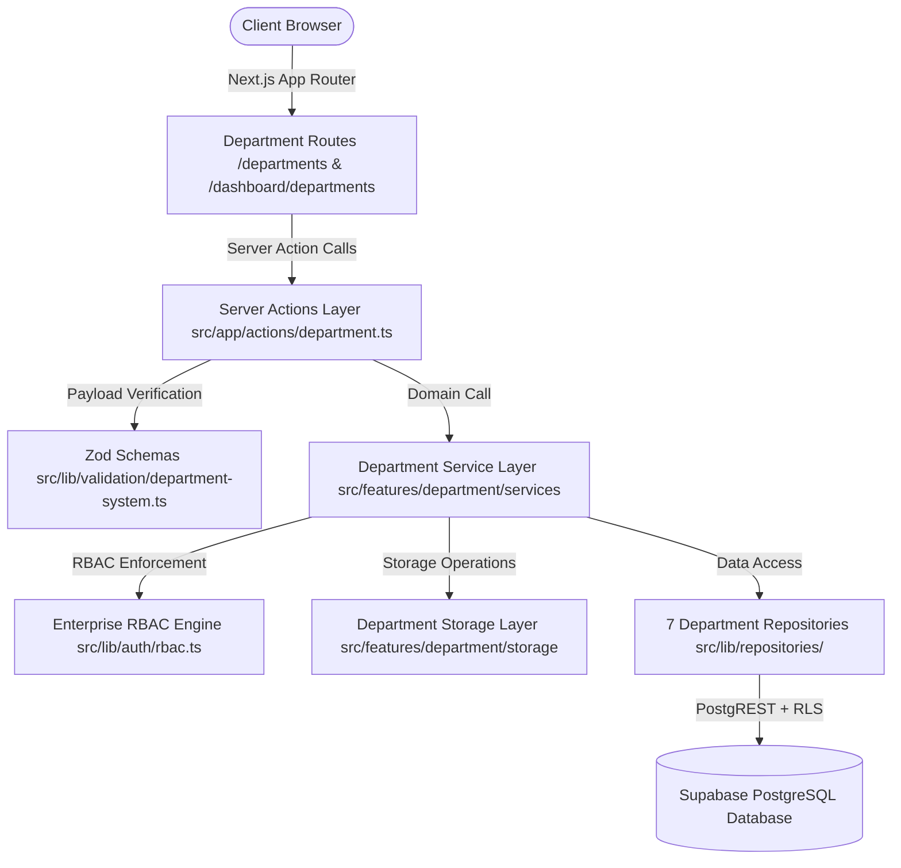
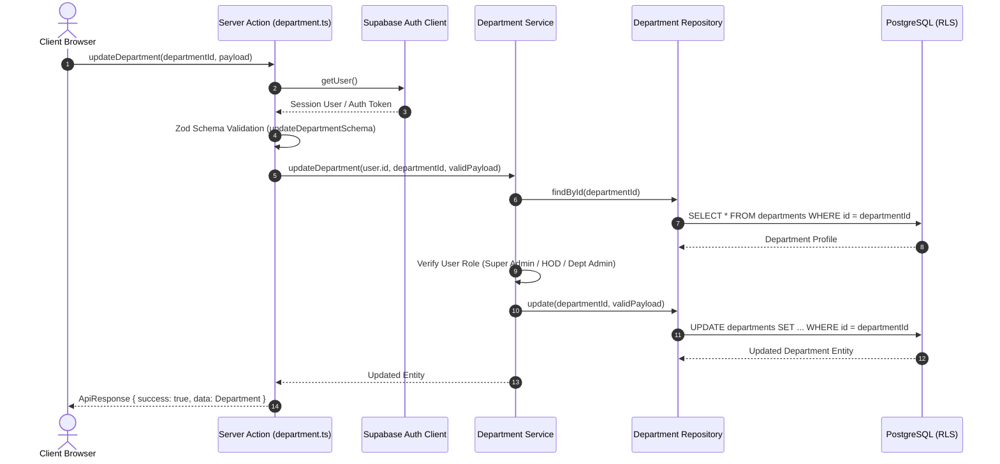
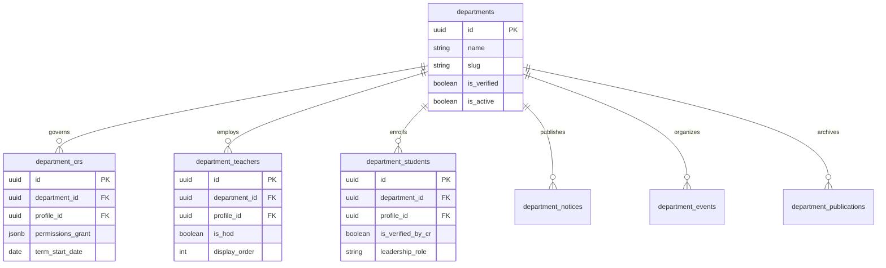

# 20 - Universal Department Ecosystem Specification

**Project:** Ravenshaw Moments — Universal Department Ecosystem  
**Version:** 3.0 (Enterprise Architectural Standard)  
**Status:** ✅ Fully Implemented & Verified  
**Document Type:** Technical Architecture & Reference Manual  

---

## 1. Department Architecture

### 1.1 Layered Architecture
The Universal Department Ecosystem enforces strict decoupling across four autonomous horizontal layers:
1. **Presentation Layer (`src/features/department/components/` & `src/app/`):** React Server Components (RSC) and Client Components strictly consuming reusable UI components without embedding business logic or direct database queries.
2. **Server Actions Layer (`src/app/actions/department.ts`):** Edge-safe boundary layer responsible for user session resolution, rate limiting, payload validation (via Zod), and unified error transformation (`handleServiceError`).
3. **Service Layer (`src/features/department/services/index.ts`):** Encapsulates all domain rules, authorization logic, transaction coordination, and structured logging.
4. **Repository Layer (`src/lib/repositories/`):** Strongly-typed abstractions over Supabase PostgREST and storage operations, ensuring zero raw SQL leakage into application code.

### 1.2 Component Architecture Diagram

### 1.3 Request Lifecycle Sequence Diagram

### 1.4 Request Lifecycle & Data Flow
1. **Request Ingestion:** The client invokes a Server Action over Next.js Server-Side RPC.
2. **Session Identification:** `createClient()` retrieves the user JWT session.
3. **Schema Validation:** Zod `safeParse` filters out untrusted fields and normalizes data.
4. **Service Execution:** Domain services evaluate role permissions and invoke repository operations.
5. **Database RLS Verification:** PostgreSQL evaluates user JWT claims against policy definitions.

---

## 2. Database Documentation

### 2.1 Entity Relationship Diagram (ERD)

### 2.2 Table Dictionary
| Table Name | Primary Key | Description | RLS Policy |
| :--- | :--- | :--- | :--- |
| `departments` | `id (UUID)` | Core department profiles, vision, mission, and establishment year. | Verified active public read; Admin write. |
| `department_crs` | `id (UUID)` | Class Representative appointments and fine-grained permission grants. | Public read active CR; Admin full management. |
| `department_teachers` | `id (UUID)` | Faculty directory roster with HOD flag and display ordering. | Public read active teachers; Admin write. |
| `department_students` | `id (UUID)` | Student directory affiliations verified by Department CRs or HODs. | Public read verified featured; Self write. |
| `department_notices` | `id (UUID)` | Official circulars, exam schedules, and departmental announcements. | Public read published; CR/Admin write. |
| `department_events` | `id (UUID)` | Academic symposiums, workshops, seminars, and departmental fests. | Public read published; CR/Admin write. |
| `department_publications` | `id (UUID)` | Annual magazines, CBCS syllabus archives, and research journals. | Public read published; CR/Admin write. |

### 2.3 SQL Views & Indexes
- **`department_public_directory_v`**: Aggregates active, verified departments with HOD display names.
- **`department_statistics_v`**: Real-time counts of enrolled students, faculty members, notices, and events.
- **Indexes**: Unique index on `departments(slug)`; compound index on `department_teachers(department_id, display_order)`; compound index on `department_notices(department_id, is_pinned, published_at DESC)`.

---

## 3. API Documentation (Server Actions)

All Server Actions reside in `src/app/actions/department.ts` and return standard `ApiResponse<T>`.

### 3.1 Public Actions
- **`listPublicDepartments(limit, offset)`**: Returns paginated list of active, verified departments.
- **`getPublicDepartmentBySlug(slug)`**: Returns aggregated department profile, HOD, faculty roster, current CR, latest notices, upcoming events, and publications.
- **`getDepartmentDashboardData(departmentId)`**: Returns complete management rosters for authenticated HODs, admins, or CRs.

### 3.2 Management Actions
- **`createDepartment(payload)`**: Super Admin action to initialize a new academic department.
- **`updateDepartment(departmentId, payload)`**: HOD or Admin action to update department profile, vision, or contact details.
- **`assignDepartmentCR(payload)`**: Appoints a student as Department CR with specific granular permissions.
- **`assignDepartmentTeacher(payload)`**: Adds a faculty member to the departmental teaching roster.
- **`verifyDepartmentStudent(studentId, isVerified)`**: CR or HOD action to verify student departmental enrollment.
- **`createDepartmentNotice(payload)`**: Publishes an official notice circular.
- **`createDepartmentEvent(payload)`**: Schedules an academic event or workshop.
- **`createDepartmentPublication(payload)`**: Uploads a departmental publication or syllabus archive.

---

## 4. Security Documentation

### 4.1 Permission Matrix across Roles
| Role / Action | Anonymous | Student | Dept CR | Faculty / HOD | Super Admin |
| :--- | :---: | :---: | :---: | :---: | :---: |
| **View Verified Departments** | ✅ | ✅ | ✅ | ✅ | ✅ |
| **View Unverified Departments** | ❌ | ❌ | ❌ | ✅ (Own) | ✅ |
| **Verify Student Affiliation** | ❌ | ❌ | ✅ | ✅ | ✅ |
| **Publish Notices / Events** | ❌ | ❌ | ✅ | ✅ | ✅ |
| **Assign Faculty / HOD** | ❌ | ❌ | ❌ | ✅ (HOD) | ✅ |
| **Create Department Profile** | ❌ | ❌ | ❌ | ❌ | ✅ |

### 4.2 Security Controls & Threat Mitigations
- **Privilege Escalation Protection:** Zod schemas strip identity and verification status fields from standard updates.
- **SQL Injection Prevention:** 100% parameterization via Supabase PostgREST client libraries.
- **Tenant Isolation:** Row Level Security policies enforce `department_id` equality checks on every operation.

---

## 5. Storage Documentation

- **Bucket:** `departments` (Private bucket with public download URLs for verified assets).
- **Folder Taxonomy:**
  - `/logos/{department_id}/{filename}`: Department crest and seal images.
  - `/banners/{department_id}/{filename}`: Cover header imagery.
  - `/publications/{department_id}/{filename}`: Magazine and syllabus PDF archives.
- **Access Policies:** Only authorized Department CRs, HODs, and Admins can PUT/DELETE files within their assigned `{department_id}` folder namespace.

---

## 6. Reusable Component Documentation

All UI components reside in `src/features/department/components/` and are built using **Shadcn UI + Tailwind CSS v4**.

### 6.1 Core & Roster Components
- **`DepartmentHeader` & `DepartmentBanner`**: Displays responsive department hero section, establishment badge, and quick stats.
- **`TeacherCard` & `TeacherGrid`**: Displays faculty members, qualifications, research tags, and HOD indicators.
- **`StudentCard` & `StudentSpotlight`**: Displays verified student leaders and featured departmental representatives.
- **`CurrentCRCard`**: Highlights the incumbent Class Representative and tenure details.

### 6.2 Showcase Components
- **`NoticeCard` & `NoticeBadge`**: Renders departmental circulars with priority tags (Critical, High, Normal).
- **`EventCard` & `UpcomingEvents`**: Renders scheduled academic workshops, dates, venues, and registration links.
- **`PublicationCard` & `PublicationList`**: Renders downloadable departmental magazines and research digests.

---

## 7. Service & Repository Layer Documentation

### 7.1 Service Layer (`src/features/department/services/index.ts`)
- **`departmentCoreService`**: Handles department profile lifecycle, active listing, and slug lookups.
- **`departmentCRService`**: Manages Class Representative appointments, tenure expirations, and granular permission checking.
- **`departmentTeacherService`**: Coordinates faculty roster ordering and HOD assignment rules.
- **`departmentStudentService`**: Coordinates student verification workflows and leadership featuring.

### 7.2 Repository Layer (`src/lib/repositories/`)
- Implements strict inheritance from `BaseRepository<T>` (`src/lib/repositories/base.repository.ts`).
- Provides unified methods: `findActive()`, `findBySlug()`, `findByDepartmentId()`, and paginated query helpers.
